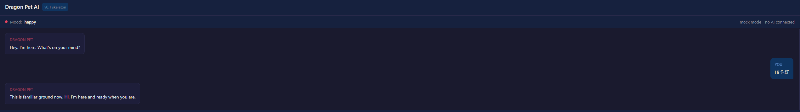
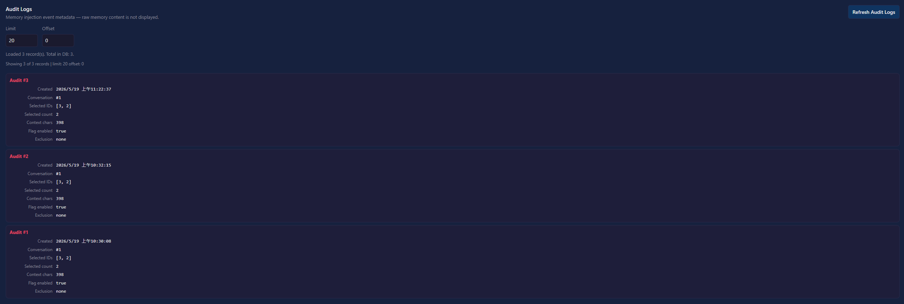
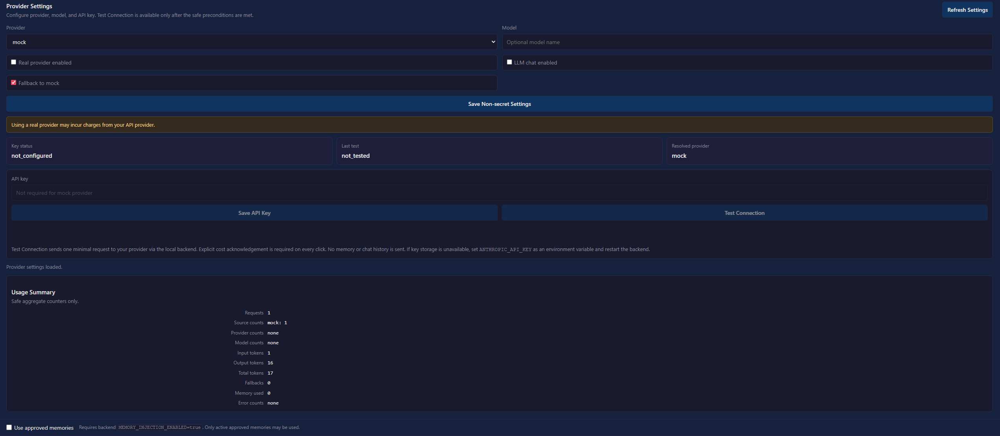
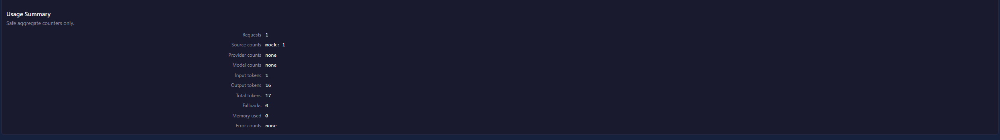
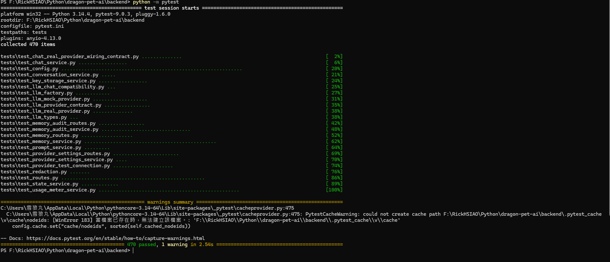

# Dragon Pet AI

> **Dragon Pet AI** 是一個本地優先的 Electron + FastAPI 桌面陪伴原型，具備手動記憶、記憶稽核日誌、BYOK 提供者設定、使用量計量、安全審查過的 Test Connection 端點、Anthropic/Ollama 提供者轉接層（隱藏在 feature flag 後）、本地 Ollama `/chat` 執行期 smoke 通過（`source=llm_local`，克莉絲蒂娜人格確認）、Ollama Provider Settings UI（無需 API Key，使用本機 GPU/CPU），以及 Full App 聊天搜尋、高亮、匯出、未讀提示、時間戳、LINE-style 日期分隔線、清除確認、empty state、Undo Clear Chat 與單則訊息刪除/復原。以安全優先的增量開發方式建構，後端 mocked 測試套件共 **586 個測試通過**。

**非生產環境。** 尚未進行任何外部 provider 的真實呼叫，亦未使用任何真實 API Key。本專案為 portfolio / prototype 性質。

📋 **[完整 Demo 腳本與面試重點](docs/PORTFOLIO_DEMO_SCRIPT.md)**
📋 **[Phase 4 Provider Settings 摘要](docs/PHASE4_PROVIDER_SETTINGS_SUMMARY.md)**

**最新本地狀態（2026-06-01）：** TASK-211 已完成 automated smoke 與 Windows visual smoke PASS。正式 user/pet 訊息可右鍵開啟低調 context menu；「編輯」只提供給最後一則正式 user message。送出修改後會更新最後 user message、移除緊接的舊 pet reply、重寫 chat history persistence，並以修改後內容重新呼叫 `/chat` 產生新回覆；hover action buttons 已移除，date separators、timestamp tooltip、empty state、search、copy/export/delete 會同步更新。未變更後端、IPC、聊天歷史格式、Pet Window、Ollama/provider runtime 或 Screen Context。

---

## 截圖



*本地優先 Electron 桌面陪伴 UI，使用 mock LLM 來源 — 無外部 provider 呼叫。*

---



*安全的純元資料稽核追蹤 — 稽核列不儲存原始記憶內容或提示文字。*

---



*BYOK provider 設定，具唯寫金鑰處理、金鑰狀態顯示與安全管控。*

---



*僅顯示安全的彙總使用量計數 — 不含原始提示文字、API Key 或 provider 回應內容。*

---



*後端 mocked 測試套件截圖（portfolio 紀錄用）；最新後端測試：586 通過，0 失敗，無外部 HTTP，無真實 API Key。*

---

## 快速啟動（本地 Ollama 模式）

> 完整說明與疑難排解：**[docs/LOCAL_DEV_RUNBOOK.md](docs/LOCAL_DEV_RUNBOOK.md)**

**Windows 第一步：解除 PowerShell 執行限制（僅本次視窗有效）**
```powershell
Set-ExecutionPolicy -Scope Process -ExecutionPolicy Bypass
```

依序開啟三個終端機（每個終端機都先執行上方指令）：

**終端機 1 — Ollama（本地 LLM 伺服器）**
```powershell
ollama serve
# 第一次使用：ollama pull qwen3:8b
```

**終端機 2 — 後端**
```powershell
.\scripts\dev-start-backend.ps1
# 自動設定所有環境變數、啟動 venv、在 :8000 啟動 uvicorn
```

**終端機 3 — Electron 桌面應用**
```powershell
.\scripts\dev-start-desktop.ps1
# 使用 npm.cmd（避免 execution-policy 問題），清除 ELECTRON_RUN_AS_NODE
```

**選用：smoke 快速檢查**
```powershell
.\scripts\dev-smoke.ps1
# 檢查 /health、/provider/settings、/provider/settings/test、/chat
# 當 Ollama 正確產生回覆時會回報 source=llm_local
# 首次 /chat 可能需要 30–90 秒等待模型 cold-start 載入
```

常見問題：
- **`.ps1` 被封鎖** → 每個終端機先執行 `Set-ExecutionPolicy -Scope Process -ExecutionPolicy Bypass`
- `uvicorn not found` → `cd backend; .venv\Scripts\pip install -r requirements.txt`
- `npm.ps1 is disabled` → 啟動腳本已自動使用 `npm.cmd`；手動時請用 `npm.cmd` 而非 `npm`
- `ELECTRON_RUN_AS_NODE` → 啟動腳本會自動清除
- Cold-start timeout → 第一次 `/chat` 模型載入最長需 90 秒；若 smoke 顯示 warmup hint，依提示執行 `ollama run qwen3:8b "請用一句繁體中文回覆：ready"` 後重試

---

## 目前狀態

| 項目 | 狀態 |
|---|---|
| 架構 | Electron 桌面 + FastAPI 後端，端對端可運作 |
| Phase 3 | ✅ 完成 — 記憶、稽核日誌、記憶感知聊天 |
| Phase 4 / v0.5.2 | ✅ 完成 — Provider Settings 持久化、partial PATCH guard、本地 Ollama timeout/cold-start UX、Christina 桌面 UI polish |
| 本地 Ollama `/chat` smoke | ✅ 通過 — `qwen3:8b`，`source=llm_local`，克莉絲蒂娜人格確認 |
| Provider Settings 持久化 | ✅ 通過 — 重啟後設定保留，partial PATCH 保留省略欄位 |
| UI polish | ✅ 通過 — 情緒→表情對應、Christina expression system |
| Full App chat UX | ✅ TASK-211 Windows visual smoke PASS — 搜尋/高亮、未讀提示、匯出、時間戳、日期分隔線、清除確認、empty state、Undo Clear Chat、單則訊息刪除/復原、右鍵訊息操作、最後 user message 編輯/重新送出 |
| 表情系統 | 7/10 real PNG（happy、focused、neutral、proud、annoyed、worried、sleepy）；pending/error/offline 為 SVG fallback |
| pytest | **586 通過，0 失敗** |
| Electron smoke | **renderer-chat PASS；pet-renderer 237 PASS；pet-window 60 PASS** |
| 外部 provider 呼叫 | ❌ 無 — 刻意封鎖 |
| 真實 API Key 使用 | ❌ 無 — 所有測試使用 mocked runner |
| 生產就緒 | ❌ 尚未 — prototype / portfolio 階段 |
| Demo 可用（本地 Ollama） | ✅ 是 |
| 下一個任務 | TASK-213 Windows visual smoke |

---

## 已完成功能

| 功能 | 備註 |
|---|---|
| `GET /health` | 後端存活確認 |
| `POST /chat` | Mock 角色回應；LLM 轉接層隱藏在 feature flag 後 |
| Electron 桌面 UI | 聊天、記憶、稽核日誌、Provider Settings 各區塊 |
| 聊天搜尋與高亮 | Full App 內建搜尋列、結果計數、Enter/Shift+Enter 導覽與 Ctrl+F 快捷鍵 |
| 聊天匯出與 copy transcript | 匯出 `.txt`、copy 全部對話，搜尋期間仍輸出完整對話 |
| 聊天時間戳與日期分隔線 | 新訊息保留 `ts`；跨日期插入今天/昨天/YYYY/MM/DD 分隔線；舊紀錄不偽造時間 |
| 清除對話確認與 empty state | 清除前需二次點擊確認；無正式 user/pet 對話時顯示低調提示；不寫入 history、不觸發 `/chat` |
| Undo Clear Chat | 清除後 10 秒內可復原最近一次 clear；恢復 DOM、日期分隔線與既有 chat history persistence |
| 單則訊息刪除 / 復原 | 正式 user/pet 訊息可用右鍵 context menu 刪除；10 秒內可復原最近一次單則刪除；不新增 IPC、不改 history format |
| Full App / Pet 未讀提示 | Full App title badge 與 Pet Window unread dot，僅傳遞窄化狀態、不傳訊息內容 |
| 手動記憶 CRUD | `POST/GET/DELETE /memory` — SQLite 持久化 |
| 記憶內容預覽 | `GET /memory/context-preview` — 安全，無注入 |
| 已審核記憶內容建構器 | 類型允許清單、信心度過濾、5 條記憶 / 1500 字元上限 |
| 記憶感知聊天（雙層閘道） | `MEMORY_INJECTION_ENABLED` 環境變數 + 每次請求 `use_memory` |
| 記憶注入稽核 API | `GET /memory/audit` — 純安全元資料，不含原始內容 |
| 稽核日誌 UI | 桌面區塊；顯示注入事件 |
| 記憶體使用量計量 | 14 個追蹤欄位；token 估算；隱私邊界 |
| Provider Settings API | `GET/PATCH /provider/settings` — 僅非敏感欄位 |
| 金鑰狀態端點 | `GET /provider/settings/key/status` — 6 個安全值，不含金鑰片段 |
| 儲存金鑰端點 | `POST /provider/settings/key` — 唯寫；金鑰不回傳 |
| 清除金鑰端點 | `DELETE /provider/settings/key` — 透過儲存抽象層清除 |
| Provider Settings UI | Provider/model 選擇、儲存金鑰、清除金鑰、金鑰狀態、使用量摘要 |
| 安全金鑰儲存抽象層 | `UnavailableBackend`（執行期）、`InMemoryBackend`（測試） |
| Test Connection 後端 | `POST /provider/settings/test` — 需明確費用確認；Opus 審查通過 |
| Test Connection UI | 費用確認對話框；安全欄位呈現；不自動執行 |
| LLM 轉接層 | Anthropic 轉接器隱藏在 `LLM_PROVIDER_ENABLED=false` 後 |
| 強化測試 | 5 個 Opus 推薦的邊界案例與安全邊界測試 |
| 本地 Ollama provider | 隱藏在 flag 後；無 API Key；僅本機；執行期 smoke 通過 — `source=llm_local`，克莉絲蒂娜人格確認 |
| Ollama Provider Settings UI | Provider 選擇器含 `ollama`；本地 provider 的 API Key 輸入隱藏/停用；Test Connection 使用本地資源警告；renderer 不直接呼叫 Ollama |
| 586 個 mocked 測試 | 完整後端測試套件；無外部 HTTP；無真實 API Key |

---

## 架構

```
Electron renderer（HTML / CSS / JS）
  └── localhost HTTP → FastAPI 後端 (:8000)
        ├── api/routes.py                        — 所有 HTTP 端點
        ├── services/
        │    ├── chat_service                    — /chat routing、LLM 轉接層
        │    ├── memory_service                  — 記憶 CRUD、已審核 context builder
        │    ├── memory_audit_service            — 稽核列建立與查詢
        │    ├── usage_meter_service             — token/費用追蹤（記憶體）
        │    ├── provider_settings_service       — 非敏感設定持久化
        │    ├── key_storage_service             — 安全金鑰儲存抽象層
        │    └── provider_test_connection_service — Test Connection 邏輯
        ├── providers/
        │    ├── mock_provider                   — 永遠啟用的安全預設值
        │    ├── anthropic_provider              — 需 LLM_PROVIDER_ENABLED flag
        │    └── provider_factory               — 依設定選擇 provider
        ├── schemas/                             — Pydantic 請求/回應模型
        └── db/                                  — SQLModel / SQLite engine
```

**關鍵設計決策：**
- **Adapter pattern** — 新增 LLM provider 只需加一個 adapter；service 與 route 層不變
- **Feature flags 全面覆蓋** — `LLM_PROVIDER_ENABLED`、`LLM_CHAT_ENABLED`、`MEMORY_INJECTION_ENABLED` 預設皆為 `false`
- **Schema 穩定性** — `/chat` 回應（`reply / mood / source`）在整個 Phase 4 保持不變
- **唯寫金鑰處理** — 無任何端點回傳 API Key 或其片段
- **測試隔離** — `InMemoryKeyStorageBackend` 與 `FakeProviderTestRunner` 透過依賴反轉注入；測試不接觸真實 provider 或真實金鑰

---

## 安全 / BYOK

**BYOK（自帶金鑰）** 表示使用者自行提供 LLM provider API Key。應用程式不內建開發者金鑰。

| 規則 | 實作方式 |
|---|---|
| API Key 不回傳給前端 | 唯寫端點；金鑰不出現在任何回應主體 |
| API Key 不儲存於 SQLite | `UnavailableBackend` 執行期預設；OS keychain 已設計（尚未接線） |
| API Key 不寫入日誌 | 禁止欄位強制執行；provider `__repr__`/`__str__` 遮蔽密文 |
| API Key 不存入 localStorage/sessionStorage | Electron renderer 不儲存或接收金鑰 |
| Test Connection 需費用確認 | 每次點擊需 `explicit_cost_ack: true`；`window.confirm()` 含 4 項揭露 |
| Test Connection 僅送出一次請求 | 16 個輸出 token；無記憶、工具、串流或歷史 |
| 未知錯誤回傳安全訊息 | `_safe_error_category()` 將未知字串歸類為 `"provider_error"` |
| 額外請求欄位被拒絕 | 所有請求 schema 套用 `ConfigDict(extra="forbid")` |
| 無真實 provider 呼叫 | 執行期預設為 `UnavailableProviderTestRunner` 與 `UnavailableKeyStorageBackend` |
| 獨立安全審查 | Test Connection 後端由 Opus 審查 — 結果：**通過** |

---

## 快速啟動（Windows PowerShell）

> 每個終端機視窗請先執行：`Set-ExecutionPolicy -Scope Process -ExecutionPolicy Bypass`

### 執行測試

```powershell
cd backend
python -m venv .venv
.venv\Scripts\Activate.ps1
pip install -r requirements.txt
python -m pytest
# 預期：586 通過
```

### 啟動後端（推薦）

```powershell
# 從 repo 根目錄執行
.\scripts\dev-start-backend.ps1
# 自動設定所有 env、啟動 venv、在 :8000 啟動 uvicorn
```

<details>
<summary>手動啟動後端（進階）</summary>

```powershell
cd backend
.venv\Scripts\Activate.ps1
$env:LLM_PROVIDER_NAME = "ollama"
$env:LLM_MODEL = "qwen3:8b"
$env:LLM_PROVIDER_ENABLED = "true"
$env:LLM_CHAT_ENABLED = "true"
$env:LLM_LOCAL_CHAT_TIMEOUT_SECONDS = "90"
$env:PYTHONIOENCODING = "utf-8"
uvicorn app.main:app --reload --port 8000
```

</details>

### 驗證後端

```powershell
Invoke-RestMethod -Uri http://localhost:8000/health
# 預期：{ status: "ok", service: "dragon-pet-ai" }
```

### 啟動 Electron 桌面應用（推薦）

> 需先確認後端在 localhost:8000 執行。

```powershell
# 從 repo 根目錄執行
.\scripts\dev-start-desktop.ps1
# 自動使用 npm.cmd、清除 ELECTRON_RUN_AS_NODE
```

<details>
<summary>手動啟動 Electron（進階 / 第一次安裝）</summary>

```powershell
cd apps\desktop
npm.cmd install   # 只需第一次執行
npm.cmd start
```

</details>

---

## 本地 LLM 模式（Ollama）

本地 LLM 模式在您自己的機器上使用 Ollama，無需 API Key，也不會將 renderer 資料直接送到 Ollama。Electron renderer 只呼叫 FastAPI 後端（`localhost:8000`）；後端負責 provider 選擇、安全檢查、使用量元資料，以及對 `localhost:11434` 的 Ollama 請求。

### 前置條件

安裝 Ollama，拉取推薦的本地模型，並確認可用：

```powershell
ollama pull qwen3:8b
ollama list
```

### 啟動本地 LLM 模式

啟動 Ollama：

```powershell
ollama serve
```

啟動後端：

```powershell
cd backend
$env:LLM_PROVIDER_ENABLED="true"
$env:LLM_CHAT_ENABLED="true"
$env:LLM_PROVIDER_NAME="ollama"
$env:LLM_MODEL="qwen3:8b"
$env:OLLAMA_BASE_URL="http://localhost:11434"
uvicorn app.main:app --reload
```

啟動 Electron：

```powershell
cd apps\desktop
npm.cmd start
```

### Provider Settings UI

開啟 Provider Settings，選擇 `ollama — 本地，無需金鑰`。

預期 UI 狀態：
- Ollama 不使用 API Key，因此 API Key 輸入欄已停用。
- 金鑰狀態顯示 `not_required`。
- Ollama 的儲存金鑰與清除金鑰不可用。
- 啟用 real provider 後，Test Connection 可用。
- Test Connection 顯示本地資源警告（使用本機 GPU/CPU，非 API 費用警告）。

### /chat Smoke 測試

後端以 Ollama 模式執行時：

```powershell
cd F:\RickHSIAO\Python\dragon-pet-ai\backend

$env:PYTHONIOENCODING="utf-8"

python -c "import json, urllib.request; data=json.dumps({'message':'你好！克莉絲蒂娜，請用你的口吻跟我說說話。'}, ensure_ascii=False).encode('utf-8'); req=urllib.request.Request('http://127.0.0.1:8000/chat', data=data, headers={'Content-Type':'application/json; charset=utf-8'}); raw=urllib.request.urlopen(req).read().decode('utf-8'); print(raw)"
```

預期結果：
- HTTP 200
- 回應 schema 維持 `reply / mood / source`
- `source` 為 `llm_local`
- `reply` 由本機 `qwen3:8b` 產生
- 回覆應帶有克莉絲蒂娜的傲嬌語氣，例如「哼」、「才不是」、「切」等

### 發布就緒 Smoke 流程

呼叫本地 LLM 模式就緒前，請依此流程確認：

1. 啟動 Ollama：`ollama serve`。
2. 確認模型：`ollama list` 應包含 `qwen3:8b`。
3. 以 `LLM_PROVIDER_ENABLED=true`、`LLM_CHAT_ENABLED=true`、`LLM_PROVIDER_NAME=ollama`、`LLM_MODEL=qwen3:8b`、選用 `LLM_LOCAL_CHAT_TIMEOUT_SECONDS=90` 啟動後端。
4. PATCH `/provider/settings`：`provider=ollama`、`model=qwen3:8b`、`real_provider_enabled=true`、`llm_chat_enabled=true`、`fallback_to_mock=false`。
5. POST `/provider/settings/test` 確認後端可連接本地 Ollama 執行期與模型（輕量本地 runtime/model 確認，非完整人格聊天產生）。
6. POST `/chat` 驗證產生結果、克莉絲蒂娜人格、`mood` 與 `source=llm_local`。
7. 以現有桌面指令啟動 Electron。
8. 在 Provider Settings 選擇 `ollama — 本地，無需金鑰`，確認 `key_status=not_required`，執行 Test Connection，再傳送聊天訊息。
9. 確認 UI 呈現回覆、更新情緒，並在聊天執行期狀態區顯示 `source: llm_local`。

### 執行期 UX 與 Fallback 政策

- 聊天執行期狀態區刻意在主 UI 可見，用於 MVP smoke 與 demo 清晰度，顯示最後一次 `/chat` 的 source 與 provider/resolved/model 摘要。
- 本地 Ollama 回覆應顯示 `source: llm_local`。
- 停用 fallback 時，本地 provider 失敗顯示 `source: llm_local_error` 與安全錯誤狀態。
- 開發與 smoke 測試使用 `fallback_to_mock=false`，讓 provider 失敗可見。
- 若較偏好以 mock 回覆取代錯誤，可用 `fallback_to_mock=true`，但 UI 會顯示 `source: mock` 並說明可能發生了 fallback。
- 若需確認本地模型確實在回應，請關閉 fallback。
- 第一次本地回應可能較慢（模型冷啟動）；Electron UI 在 `/chat` 等待期間顯示冷啟動載入訊息。本地聊天產生使用 `LLM_LOCAL_CHAT_TIMEOUT_SECONDS`（預設 90 秒），比雲端 provider 呼叫有更長的等待時間。

### 疑難排解

| 症狀 | 處理方式 |
|---|---|
| `ollama` 找不到 | 安裝 Ollama 後重開終端機確認 `ollama` 在 PATH 上 |
| `qwen3:8b` 找不到 | 執行 `ollama pull qwen3:8b`，再以 `ollama list` 確認 |
| Test Connection 失敗 | 確認 `ollama serve` 執行中，且 `OLLAMA_BASE_URL` 為 `http://localhost:11434` |
| `/chat` 回傳 `source=mock` | 確認 `llm_chat_enabled=true`；若 `resolved_provider=ollama`，確認 `fallback_to_mock=true` 未允許 fallback 後本地 provider 失敗 |
| `/chat` 回傳 `source=llm_local_error` | Ollama 已選擇但本地產生失敗；確認 `ollama serve`、模型名稱、timeout/冷啟動行為；若首次本地回應載入慢，可增加 `LLM_LOCAL_CHAT_TIMEOUT_SECONDS` |
| Provider Settings 失去 `model` 或 fallback 意外變更 | 儲存前先重新整理 Provider Settings；部分 PATCH 會保留省略欄位，Test Connection 不會持久化設定 |
| 回覆缺乏克莉絲蒂娜口吻 | 確認後端執行最新程式碼，重啟後端以載入提示詞變更 |
| 後端似乎忽略新設定 | 停止並重啟後端；環境變數與 provider 設定由後端程序讀取 |

### 本地 LLM 安全規則

- 不在 Electron renderer 新增直接呼叫 `localhost:11434`。
- 不將 Ollama 視為需要 API Key 的 provider。
- 不更改 `/chat` 回應 schema。
- 不在 Ollama 模式呼叫 Anthropic/OpenAI 或任何外部 provider。
- 不新增依賴網路的自動化測試；測試必須繼續使用 mocked transport。

---

## Demo 與 Portfolio 連結

| 文件 | 用途 |
|---|---|
| [docs/PORTFOLIO_DEMO_SCRIPT.md](docs/PORTFOLIO_DEMO_SCRIPT.md) | 完整 demo 腳本：一句話介紹、30 秒 pitch、2 分鐘走場、面試重點、截圖清單 |
| [docs/PORTFOLIO_SCREENSHOT_CHECKLIST.md](docs/PORTFOLIO_SCREENSHOT_CHECKLIST.md) | 截圖計畫：9 張必要截圖、命名規範、設定指令、不應顯示的內容 |
| [docs/OLLAMA_PROVIDER_DESIGN.md](docs/OLLAMA_PROVIDER_DESIGN.md) | 本地 Ollama provider 設計與 TASK-074 contract test 說明：API 合約、qwen3:8b 建議、provider 設定整合、feature flags、安全邊界 |
| [docs/OLLAMA_RUNTIME_SMOKE_CHECKLIST.md](docs/OLLAMA_RUNTIME_SMOKE_CHECKLIST.md) | TASK-075 執行期 smoke 清單 — **通過**（2026-05-21）：`source=llm_local`，克莉絲蒂娜人格確認，無外部 API |
| [docs/PHASE4_PROVIDER_SETTINGS_SUMMARY.md](docs/PHASE4_PROVIDER_SETTINGS_SUMMARY.md) | Phase 4 穩定摘要：已完成功能、安全邊界、測試結果、正式 smoke 通過條件 |
| [docs/PROVIDER_TEST_CONNECTION_DESIGN.md](docs/PROVIDER_TEST_CONNECTION_DESIGN.md) | Test Connection 設計與強化測試結果 |
| [docs/SECURE_KEY_STORAGE_DESIGN.md](docs/SECURE_KEY_STORAGE_DESIGN.md) | 金鑰儲存威脅模型、儲存選項、遮蔽規則 |
| [docs/BYOK_PRODUCT_AND_SETTINGS.md](docs/BYOK_PRODUCT_AND_SETTINGS.md) | BYOK 產品設計與安全邊界 |
| [docs/ROADMAP.md](docs/ROADMAP.md) | 完整階段開發路線圖；目前下一步為 TASK-213 Windows visual smoke |
| [docs/TASKS.md](docs/TASKS.md) | 完整任務歷史記錄；最新記錄為 TASK-213 Context Menu Viewport / Accessibility Polish automated smoke PASS，Windows visual smoke pending |
| [docs/STREAMER_COMPANION_MODE.md](docs/STREAMER_COMPANION_MODE.md) | 未來支線 — OBS overlay / Twitch 陪伴設計（尚未排程） |

---

## 目前限制

| 限制 | 說明 |
|---|---|
| 無真實 provider 呼叫 | 執行期金鑰儲存不可用；Test Connection 按鈕設計上停用 |
| 未使用真實 API Key | 所有測試使用 mocked runner 與記憶體假儲存 |
| OS keychain 未接線 | 儲存抽象層已就緒；`keytar` backend 尚未實作 |
| 使用量計量為記憶體 | 後端重啟後重置；持久化計量延後 |
| 無自動記憶擷取 | 所有記憶須手動建立 |
| 無串流 / 工具 / TTS / Live2D | 超出目前階段範疇 |
| 無安裝程式 / 封裝 | 尚未封裝為可發布應用程式 |
| 非帳單精確 | token 費用估算使用規則式近似值 |

---

## 目錄結構

```
dragon-pet-ai/
  apps/
    desktop/
      package.json
      src/
        main.js               # Electron 主程序
        renderer/
          index.html          # 主視窗 HTML
          renderer.js         # UI 邏輯、後端呼叫
          styles.css          # 樣式
  backend/
    app/
      main.py                 # FastAPI 進入點
      api/routes.py           # 所有 HTTP 端點
      core/config.py          # Feature flags、環境設定
      db/database.py          # SQLModel engine
      schemas/                # Pydantic 請求/回應模型
      services/               # 業務邏輯（每個服務一個檔案）
      providers/              # LLM 轉接層
    tests/                    # pytest 套件（586 個測試）
    requirements.txt
  docs/                       # 所有設計文件
  scripts/                    # PowerShell 啟動腳本
  .env.example
  README.md
```

---

## 所有設計文件

| 文件 | 主題 |
|---|---|
| `docs/TASKS.md` | 任務歷史與進度追蹤 |
| `docs/ROADMAP.md` | 階段式開發路線圖 |
| `docs/PRD.md` | MVP 產品需求 |
| `docs/ARCHITECTURE.md` | 系統架構 |
| `docs/CHARACTER_SPEC.md` | 角色人格規格 |
| `docs/MEMORY_SYSTEM.md` | 記憶系統設計 |
| `docs/PHASE3_DEMO_SUMMARY.md` | Phase 3 demo 摘要與安全模型 |
| `docs/PHASE4_PLAN.md` | Phase 4 規劃：選項、安全限制、任務順序 |
| `docs/PHASE4_PROVIDER_SETTINGS_SUMMARY.md` | Phase 4 Provider Settings 穩定摘要（TASK-045 至 TASK-064） |
| `docs/LLM_ADAPTER_DESIGN.md` | LLM 轉接層架構：provider 介面、feature flags、安全規則 |
| `docs/LLM_PROVIDER_CONTRACT.md` | Anthropic 請求/回應/錯誤對應、mocked fixtures |
| `docs/CHAT_LLM_WIRING_DESIGN.md` | 聊天 LLM 接線設計：`LLM_CHAT_ENABLED`、轉接流程、fallback |
| `docs/CHAT_LLM_REAL_PROVIDER_WIRING_DESIGN.md` | 真實 provider /chat 接線設計：flag 矩陣、source 行為 |
| `docs/COST_AND_MONETIZATION.md` | 費用控制與正式 smoke 通過條件 |
| `docs/BYOK_PRODUCT_AND_SETTINGS.md` | BYOK 產品設計：金鑰所有權、儲存、安全邊界 |
| `docs/USAGE_METER_DESIGN.md` | 使用量計量：14 個追蹤欄位、token 估算、隱私邊界 |
| `docs/PROVIDER_SETTINGS_UI_DESIGN.md` | Provider Settings UI：9 步設定流程、錯誤 UX、安全邊界 |
| `docs/PROVIDER_SETTINGS_API_DESIGN.md` | Provider Settings API：6 個端點、唯寫金鑰處理、安全狀態模型 |
| `docs/SECURE_KEY_STORAGE_DESIGN.md` | 安全金鑰儲存：4 個選項、威脅模型、遮蔽規則 |
| `docs/PROVIDER_SETTINGS_KEY_UI_ENABLEMENT_DESIGN.md` | 儲存金鑰 / 清除金鑰 UI 流程、儲存不可用 UX、金鑰狀態顯示 |
| `docs/PROVIDER_TEST_CONNECTION_DESIGN.md` | Test Connection 設計與強化測試結果（Opus 審查通過） |
| `docs/PORTFOLIO_DEMO_SCRIPT.md` | Portfolio demo 腳本：30 秒 pitch、2 分鐘走場、面試重點 |
| `docs/OLLAMA_PROVIDER_DESIGN.md` | 本地 Ollama provider 設計與 contract test 說明 |
| `docs/OLLAMA_RUNTIME_SMOKE_CHECKLIST.md` | TASK-075 本地 Ollama 執行期 smoke 清單 |
| `docs/LOCAL_DEV_RUNBOOK.md` | 本地開發執行手冊：啟動順序、腳本用法、環境變數、疑難排解 |
| `docs/STREAMER_COMPANION_MODE.md` | 未來支線：OBS overlay / Twitch 陪伴（尚未排程） |

---

## 開發原則

- **文件先於程式碼** — 每個功能在實作前先撰寫規格
- **範疇紀律** — 功能屬於一個階段；Phase N 期間不做 Phase N+1 的工作
- **安全優先** — 任何觸及使用者資料或產生費用的功能，都需要安全設計步驟
- **本地優先** — 所有使用者資料留在裝置上，除非使用者明確選擇雲端功能
- **可逆步驟** — 優先選擇不造成資料損失即可復原的設計

---

## 開發日誌

> 內部任務更新日誌，記錄每個任務的變更內容。

<details>
<summary>展開任務更新歷史（TASK-054 — TASK-211 摘要）</summary>

> TASK-054：provider 金鑰儲存/清除端點已接線至安全金鑰儲存抽象層。執行期預設維持安全的不可用後端；測試使用記憶體假後端進行儲存/清除/冪等清除/取代行為；金鑰不寫入 SQLite 或純文字設定檔；正式 Test Connection 維持停用。無外部 provider 呼叫。pytest：449 通過。

> TASK-055：金鑰 UI 啟用設計完成。儲存金鑰與清除金鑰控制項現已設計完整互動流程、儲存不可用 UX（503 — 安全訊息、環境變數建議）、金鑰狀態顯示（6 個安全值，不含金鑰片段）與安全邊界。Test Connection 維持停用。

> TASK-056：儲存金鑰與清除金鑰控制項現已在 Provider Settings UI 啟用。真實 provider 才啟用金鑰輸入，mock 時停用。儲存金鑰 POST 至本地後端，每次嘗試後清除輸入欄位。清除金鑰顯示確認對話框並 DELETE 透過本地後端。儲存不可用（503）顯示安全訊息與環境變數說明。API Key 不寫入日誌、不存入 localStorage/sessionStorage、不送至外部 provider。Test Connection 維持停用。pytest：449 通過。

> TASK-058：Provider Test Connection 設計已文件化。Test Connection 在執行期維持停用，需未來的每次點擊 `explicit_cost_ack`，僅送出一次最小請求，不重試/工具/串流/記憶，且不 fallback 至 mock。無真實 provider 呼叫。

> TASK-059：後端 `POST /provider/settings/test` 已實作，支援 mocked-provider runner。需每次點擊 `explicit_cost_ack`，建立一次最小無記憶/無工具/無串流請求，記錄安全彙總使用量，且不 fallback 至 mock。執行期預設 runner 不呼叫外部 provider；Electron Test Connection UI 維持停用。pytest：465 通過。

> TASK-059R：TASK-059 後端的 Opus 安全審查：結果通過。無重大問題。`explicit_cost_ack` 在 API 邊界強制執行，回應 schema 不含敏感欄位，執行期預設 runner 為 UnavailableProviderTestRunner，測試中無真實外部 API 呼叫。TASK-060 解除封鎖。

> TASK-060：Test Connection 按鈕已在 Electron renderer 啟用。啟用條件：已選真實 provider、key_status configured、real_provider_enabled true。每次點擊需明確費用確認（window.confirm）— 涵蓋全部 4 項必要揭露。僅 POST 至本地後端，body 為 {provider, model, explicit_cost_ack: true} — 無 api_key、無 prompt、無記憶。安全回應欄位呈現：status、safe_message、error_category、source、usage_estimate。儲存金鑰後不自動測試。renderer 無外部 provider URL。API Key 不寫入日誌、不存入 localStorage/sessionStorage。node --check：通過。pytest：465 通過。

> TASK-061：執行期 smoke 確認（預期限制）。Test Connection 按鈕正確維持停用（key_status: not_configured，無金鑰儲存 — 預期安全行為）。無真實外部 provider 呼叫。

> TASK-062：Provider Test Connection 強化測試完成。新增 5 個 Opus 推薦的強化測試：provider_disabled branch 含已設定金鑰（runner 不被呼叫）、invalid_model 在 runner 呼叫前回傳 400、未知錯誤歸類為 provider_error（原始字串不洩漏）、額外欄位拒絕且不回傳值（ConfigDict extra=forbid）、safe_message 類別涵蓋全部 11 個錯誤類別。pytest：470 通過，0 失敗。未修改後端邏輯。未修改 Electron UI。

> TASK-063：Electron Provider Settings UI 排版修正完成。改善 renderer 可讀性、垂直捲動、Provider Settings 狀態卡片、使用量摘要、表單間距、按鈕換行及窄視窗 DevTools 停靠版面。儲存金鑰 / 清除金鑰 / Test Connection 行為不變。未修改後端/應用程式程式碼。未變更 provider 行為。無外部 API 呼叫。Electron 靜態檢查通過。

> TASK-064：Provider Settings UI 執行期 smoke 再確認（非阻塞 UI 備注）。TASK-063 修整後所有 provider 設定控制項確認可讀且可用。Test Connection 正確停用（key_status: not_configured — 預期安全行為）。無真實外部 provider 呼叫。未輸入真實 API Key。

> TASK-065：Phase 4 Provider Settings 穩定摘要完成。建立 docs/PHASE4_PROVIDER_SETTINGS_SUMMARY.md，涵蓋 TASK-045 至 TASK-064：已完成功能、安全邊界（16 條規則）、已實作與刻意未實作、執行期限制、非阻塞 UI 備注、測試結果（470 通過）、正式 smoke 通過條件（全部未達成 — 無真實呼叫）及建議後續任務。未修改後端/應用程式程式碼。無外部 API 呼叫。

> TASK-066D：Portfolio Demo 腳本完成。建立 docs/PORTFOLIO_DEMO_SCRIPT.md，含專案一句話介紹、30 秒 pitch、2 分鐘 demo 腳本（10 步）、架構重點、已完成功能表（21 項）、安全/BYOK 說明、截圖清單（9 項）、不應宣稱的事項（8 項）、面試重點（8 個主題）及 PowerShell demo 指令。專案已達 demo 就緒（本地 mock）。無真實外部 provider 呼叫。未使用真實 API Key。未修改後端/應用程式程式碼。

> TASK-067D：README 整理為 portfolio 友善的進入點。新增專案一句話介紹、目前狀態表、已完成功能表（21 項）、含關鍵設計決策的架構圖、安全/BYOK 摘要表、PowerShell 快速啟動、demo & portfolio 連結、目前限制表、更新目錄結構、更新文件表。將任務更新歷史移至可折疊的開發日誌區塊。未修改後端/應用程式程式碼。無外部 API 呼叫。

> TASK-198 — TASK-207：Full App 聊天 UX polish 已連續完成搜尋/篩選、Ctrl+F/Esc 快捷鍵、搜尋高亮與結果導覽、未讀 title badge、平滑 auto-scroll 與新訊息跳轉、完整時間戳 tooltip、Pet unread dot、聊天匯出、時間戳持久化修正，以及 LINE-style 日期分隔線。最新 TASK-207 通過 renderer-chat / pet-renderer / pet-window 三個 smoke suite；未修改後端、IPC、聊天歷史格式或 Pet Window。

> TASK-208：Clear Chat Confirmation / Empty Chat State 完成 automated smoke 與 Windows visual smoke PASS。清除對話改為二次點擊確認，6 秒後自動取消；成功清除後重置搜尋、日期分隔線狀態與新訊息跳轉按鈕，並顯示 empty state。empty state 不在 `#chat-area` 內，不寫入 history，不觸發 `/chat`、Pet Bubble 或 TTS，也不進入 copy/export。

> TASK-209：Undo Clear Chat 完成 automated smoke 與 Windows visual smoke PASS。清除後 10 秒內顯示低調「復原」入口；復原只還原最近一次 clear 的正式 user/pet 對話，重建 DOM、日期分隔線、timestamp tooltip，並透過既有 `chatHistoryAppend` 寫回 persistence。Undo 不復原 startup greeting/status/date separator，不觸發 `/chat`、Pet Bubble 或 TTS。

> TASK-210：Single Message Delete / Undo 完成 automated smoke 與 Windows visual smoke PASS。單則刪除/復原能力仍保留；TASK-211 後操作入口改為右鍵 context menu，不再使用 hover action buttons。Delete/undo 透過既有 `chatHistoryClear` + `chatHistoryAppend` 重寫 persistence，重建 DOM、date separators、timestamp tooltip 與 empty state，並保留 search query/highlight/navigation。Startup greeting/status/date separator 不可刪除；不觸發 `/chat`、Pet Bubble 或 TTS。
>
> TASK-211：Message Context Menu + Edit Last User Message Only 完成 automated smoke 與 Windows visual smoke PASS。正式 user/pet 訊息可右鍵開啟低調 context menu；選單提供「複製」「刪除」，且只有最後一則正式 user message 顯示「編輯」。hover action buttons 已移除；舊 user message、pet/status/startup/date separator 不可編輯。編輯會把原文字放回輸入框並可用「取消」或 Esc 取消；送出修改後只更新最後 user message、移除緊接的舊 pet reply、清空 search、重寫 persistence，並只在送出修改時呼叫 `/chat` 取得新 pet reply。不新增後端、IPC、聊天歷史格式、Pet Window 或 provider/runtime 變更。

</details>
