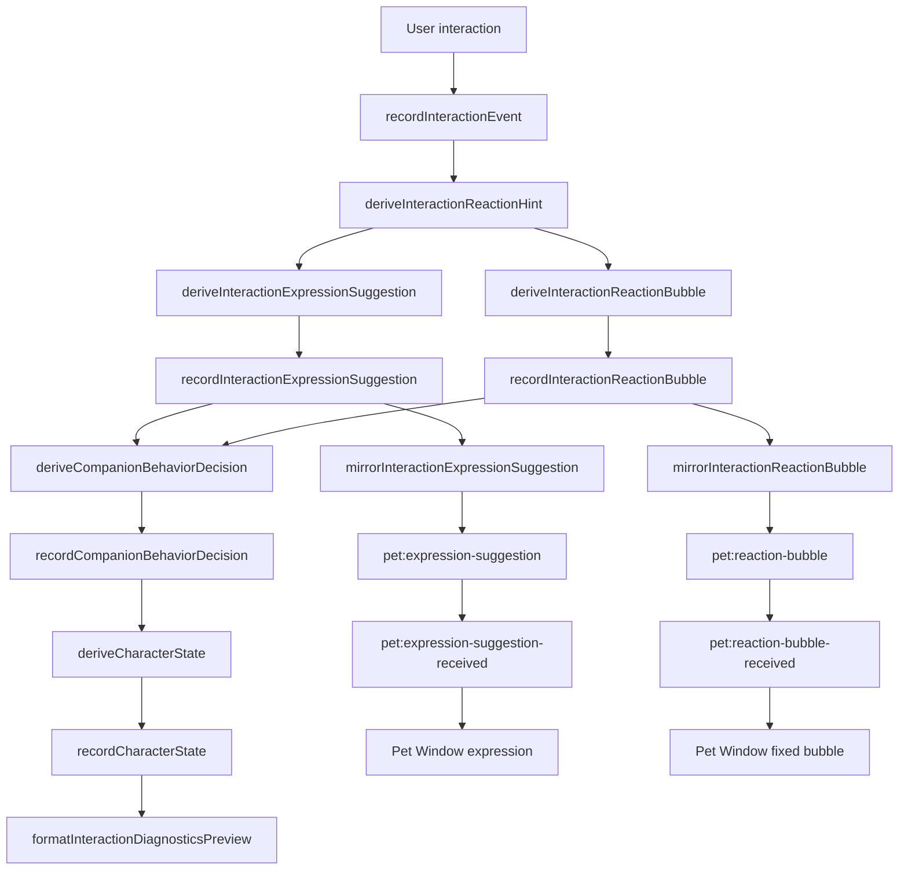

# Interactive Companion Architecture Checkpoint

**Status:** TASK-222 DOCS CHECKPOINT COMPLETE; TASK-224 DONE - WINDOWS VISUAL SMOKE PASS / DONE - PASS
**Date:** 2026-06-01
**Scope:** Architecture checkpoint for TASK-214 through TASK-224.

This document records the current interactive companion architecture after the
TASK-214 through TASK-224 chain.

---

## 1. Architecture Checkpoint Summary

Dragon Pet AI is no longer only a static chat app. The Full App now has a
local interaction stack that can observe explicit user interactions and convert
them into safe companion-facing signals.

The current system is still conservative:

- Full App remains the primary input surface.
- Pet Window remains display-oriented.
- Interaction signals are local and allowlisted.
- Pet Window side effects are narrow and explicit.
- The behavior policy layer is currently a summary/preview layer, not an
  execution controller.

The completed stack now supports this pipeline:

```text
user interaction
-> interaction event
-> reaction hint
-> expression suggestion
-> behavior decision
-> character state
-> expression mirror / reaction bubble
-> Pet Window expression / fixed short bubble
```

---

## 2. Completed Task Chain

| Task | Layer | Result |
|---|---|---|
| TASK-214 | Interaction event | Records sanitized Full App interaction events. |
| TASK-215 | Reaction hint | Maps events to semantic hints. |
| TASK-216 | Reaction preview | Shows local preview text in Full App. |
| TASK-217 | Expression suggestion | Maps reaction hints to local expression suggestions. |
| TASK-218 | Pet Window expression mirror | Mirrors allowlisted expression suggestions to Pet Window. |
| TASK-219 | Expression mirror cooldown / debounce | Coalesces rapid expression mirrors; latest wins. |
| TASK-220 | Safe reaction bubble mirror | Mirrors fixed allowlisted short reaction bubbles. |
| TASK-221 | Behavior policy | Summarizes hint/expression/bubble into a local decision object. |
| TASK-222 | Architecture checkpoint | Records the interactive companion architecture. |
| TASK-223 | Character state layer | Summarizes mood, attention, energy, and recent interaction level. DONE - Windows visual smoke PASS. |
| TASK-224 | Character state preview diagnostics | Formats local reaction, decision, state, and level preview. DONE - Windows visual smoke PASS. |

---

## 3. Current Data Flow



Runtime ordering in the Full App renderer:

```text
User interaction
-> recordInteractionEvent
-> deriveInteractionReactionHint
-> deriveInteractionExpressionSuggestion
-> deriveInteractionReactionBubble
-> deriveCompanionBehaviorDecision
-> deriveCharacterState
-> formatInteractionDiagnosticsPreview
-> mirrorExpression / mirrorReactionBubble
-> Pet Window expression / fixed bubble
```

The behavior decision, character state, and diagnostics preview are local-only.
They are not sent to the Pet Window and do not drive the mirror calls.

---

## 4. Layer Responsibility Table

| Layer | Input | Output | Side-effect | Safety boundary |
|---|---|---|---|---|
| Interaction event layer | Explicit Full App events | Sanitized event entries | Local ring buffer only | No raw text; allowlisted event types. |
| Reaction hint layer | Sanitized event | Allowlisted reaction hint | Local hint state | Unknown values fall back to `none`. |
| Expression suggestion layer | Reaction hint | Allowlisted expression | Local expression state; existing mirror path | Expressions restricted to allowlist. |
| Behavior policy layer | Hint, expression, bubble id | Decision object | Local preview/summary only | No IPC, no Pet Window payload, no raw text. |
| Character state layer | Behavior decision, hint, expression, recent events | `attention/energy/mood/recentInteractionLevel/source/reason/ts` | Local preview/summary only | No IPC, no Pet Window payload, no raw text, no timers. |
| Preview diagnostics layer | Hint, expression, decision, character state | `Reaction/Suggestion/Decision/State/Level` text | Local Full App display only | `textContent`; allowlisted tokens only; no raw JSON or message text. |
| Expression mirror layer | Expression suggestion | `expression/source/ts` payload | Narrow IPC to Pet Window | No message text; no bubble/TTS/chat. |
| Expression debounce layer | Expression mirror requests | Latest pending expression | Coalesced mirror timing | 300ms cooldown; latest wins. |
| Reaction bubble mirror layer | Reaction bubble id | `id/text/source/ts/ttlMs` payload | Narrow IPC to Pet Window | Text comes from fixed allowlist mapping. |
| Pet Window handler layer | Narrow IPC payloads | Expression or fixed bubble display | Updates Pet UI only | No `/chat`, no TTS, no history write. |

---

## 5. IPC Channel Inventory

Current narrow IPC channels used by the interaction companion stack:

| Purpose | Channel |
|---|---|
| Full App renderer preload -> main expression suggestion | `pet:expression-suggestion` |
| main -> Pet Window expression suggestion | `pet:expression-suggestion-received` |
| Full App renderer preload -> main reaction bubble | `pet:reaction-bubble` |
| main -> Pet Window reaction bubble | `pet:reaction-bubble-received` |

Rules:

- Generic `"pet"` is not used for expression suggestion or reaction bubble.
- Raw message text is not sent through these channels.
- Expression payload contains only `expression/source/ts`.
- Reaction bubble payload contains only `id/text/source/ts/ttlMs`.
- Reaction bubble text is derived from fixed allowlist mapping.
- Behavior decision objects are not sent through IPC.
- Character state objects are not sent through IPC.

---

## 6. Safety Boundary / Permanent Forbidden List

The interactive companion stack must continue to forbid:

- Autonomous long speech.
- TTS side effects from interaction signals.
- `/chat` calls from interaction signals.
- Chat history writes from interaction signals.
- Raw user message text sent to Pet Window.
- Background monitoring.
- Screenshot capture.
- OCR.
- Always listening behavior.
- LLM-generated reaction bubbles.
- Reaction bubble text entering copy/export/history.
- Generic IPC for companion interaction signals.
- Backend/provider/Ollama runtime changes for these local interaction layers.
- Character state driving Pet Window behavior before an explicit future task.

---

## 7. Current Behavior Examples

| Event | Hint | Expression | Reaction bubble |
|---|---|---|---|
| `chat_message_sent` | `user_active` | `focused` | `哼，總算肯理吾了。` |
| `message_deleted` | `message_management` | `neutral` | `整理好了？手腳還算俐落。` |
| `message_edited` | `correction` | `annoyed` | `又改？下次可要想清楚。` |
| `chat_history_cleared` | `reset` | `neutral` | `清空了。重新開始也無妨。` |
| `full_app_focused` | `attention_returned` | `happy` | `回來了？吾才沒有等汝。` |

Behavior decision examples:

| Hint | Decision action |
|---|---|
| `user_active` | `mirror_expression_and_bubble` |
| `message_management` | `mirror_expression_and_bubble` |
| `correction` | `mirror_expression_and_bubble` |
| `reset` | `mirror_expression_and_bubble` |
| `attention_returned` | `mirror_expression_and_bubble` |
| `pet_attention` | `mirror_expression` |
| `none` | `none` |

Character state examples:

| Hint | Mood | Attention | Energy |
|---|---|---|---|
| `none` | `neutral` | `idle` | `calm` |
| `user_active` | `focused` | `active` | `attentive` |
| `message_management` | `neutral` | `managing` | `calm` |
| `correction` | `annoyed` | `correcting` | `attentive` |
| `reset` | `neutral` | `reset` | `calm` |
| `attention_returned` | `happy` | `returned` | `lively` |
| `pet_attention` | `proud` | `active` | `lively` |

Character state fields:

| Field | Meaning |
|---|---|
| `attention` | Current attention posture: `idle`, `active`, `returned`, `managing`, `correcting`, or `reset`. |
| `energy` | Current energy posture: `calm`, `attentive`, `lively`, or `resting`. |
| `mood` | Current local mood summary: `neutral`, `focused`, `happy`, `proud`, `annoyed`, or `sleepy`. |
| `recentInteractionLevel` | Local interaction density summary: `none`, `low`, `medium`, or `high`. |
| `source` | Fixed to `character_state_layer`. |
| `reason` | The allowlisted reaction hint driving the state. |
| `ts` | Local timestamp for the state record. |

TASK-224 preview diagnostics format:

```text
Reaction: <hint> · Suggestion: <expression>
Decision: <action> · State: <mood>/<attention>/<energy> · Level: <recentInteractionLevel>
```

Fallback diagnostics values are fixed to `Reaction: none`,
`Suggestion: neutral`, `Decision: none`, `State: neutral/idle/calm`, and
`Level: none`. The preview is local Full App text only and must never include
raw JSON, raw event payloads, raw user message text, backend/provider
diagnostics, or Pet Window payload data.

---

## 8. Smoke Coverage Summary

The completed stack is covered by:

- `renderer-chat-smoke.js`
- `pet-window-smoke.js`
- `pet-renderer-smoke.js`
- Windows visual smoke for TASK-214 through TASK-224
- Automated smoke for TASK-223
- Automated smoke for TASK-224
- history/copy/export boundary checks
- no TTS side-effect checks
- no `/chat` side-effect checks
- no generic IPC checks
- Pet expression mirror checks
- reaction bubble TTL restore checks

TASK-223 Windows visual smoke PASS confirmed on 2026-06-01. Confirmed preview
states: startup `neutral/idle/calm`, send `focused/active/attentive`,
delete/undo `neutral/managing/calm`, edit `annoyed/correcting/attentive`,
clear `neutral/reset/calm`, and focus `happy/returned/lively`. Continuous
interactions showed no `undefined`, `null`, `[object Object]`, or raw JSON.

TASK-224 automated smoke and Windows visual smoke PASS confirmed on 2026-06-01.
Confirmed diagnostics preview fallback, `Level` display, event mappings, raw
text/raw JSON exclusion, history/copy/export boundary, no `/chat`/TTS/Pet
Bubble side effects, and no new IPC. Windows visual smoke confirmed startup
Reaction/Suggestion plus Decision/State/Level display, valid Level values for
send/delete/edit/clear/focus, no `undefined`, `null`, `[object Object]`, `NaN`,
raw JSON, or user text, and no Pet Window expression/reaction bubble regression.

---

## 9. Known Boundaries / Not Yet Implemented

The current system does not yet implement:

- Relationship state.
- Idle reaction policy.
- LLM-based proactive reaction.
- Screen context behavior in the companion policy.
- OCR behavior in the companion policy.
- Always listening.
- User-configurable behavior policy.
- Behavior decision controlling execution.

Important: TASK-221 behavior decisions, TASK-223 character states, and TASK-224
diagnostics previews are currently summary/preview only. They do not execute
actions directly.

---

## 10. Recommended Next Phase

Recommended next architecture phase:

- Relationship state.
- Mood / attention / energy state beyond the local preview foundation.
- Idle reaction policy.
- Behavior policy starts controlling execution.
- Safe reaction frequency governor.

These should still avoid jumping directly to LLM proactive speech, screen
monitoring, OCR, always listening, or broad IPC. Each capability should be
introduced behind a narrow, testable, explicit user-controlled boundary.
