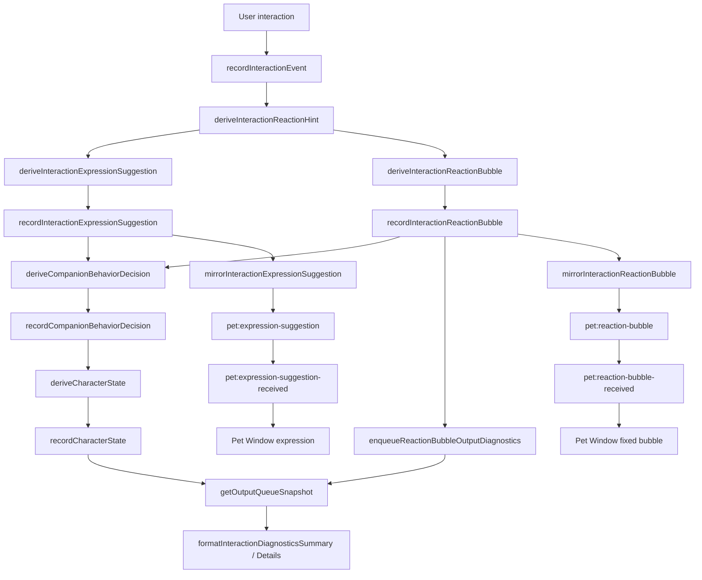

# Interactive Companion Architecture Checkpoint

**Status:** TASK-222 DOCS CHECKPOINT COMPLETE; TASK-236 DONE - WINDOWS VISUAL SMOKE PASS / DONE - PASS; TASK-237 IMPLEMENTED - DOCS CHECKPOINT / NO WINDOWS SMOKE REQUIRED; TASK-261 DONE - WINDOWS OWNER VOICE STORAGE/UI SMOKE PASS; TASK-262 DONE - WINDOWS OWNER VOICE CALIBRATION SMOKE PASS; TASK-263 DONE - Windows Unicode owner voice enrollment storage smoke PASS; TASK-264 DONE - Windows stored centroid verification smoke PASS
**Date:** 2026-06-01
**Scope:** Architecture checkpoint for TASK-214 through TASK-230.

This document records the current interactive companion architecture after the
TASK-214 through TASK-230 chain.

---

## 1. Architecture Checkpoint Summary

Dragon Pet AI is no longer only a static chat app. The Full App now has a
local interaction stack that can observe explicit user interactions and convert
them into safe companion-facing signals.

The current system is still conservative:

- Full App remains the primary input surface.
- Pet Window remains display-oriented.
- Interaction signals are local and allowlisted.
- Pet Window side effects are narrow and explicit.
- The behavior policy layer is currently a summary/preview layer, not an
  execution controller.

The completed stack now supports this pipeline:

```text
user interaction
-> interaction event
-> reaction hint
-> expression suggestion
-> behavior decision
-> character state
-> output queue snapshot / diagnostics preview
-> expression mirror / reaction bubble
-> Pet Window expression / fixed short bubble
```

---

## 2. Completed Task Chain

| Task | Layer | Result |
|---|---|---|
| TASK-214 | Interaction event | Records sanitized Full App interaction events. |
| TASK-215 | Reaction hint | Maps events to semantic hints. |
| TASK-216 | Reaction preview | Shows local preview text in Full App. |
| TASK-217 | Expression suggestion | Maps reaction hints to local expression suggestions. |
| TASK-218 | Pet Window expression mirror | Mirrors allowlisted expression suggestions to Pet Window. |
| TASK-219 | Expression mirror cooldown / debounce | Coalesces rapid expression mirrors; latest wins. |
| TASK-220 | Safe reaction bubble mirror | Mirrors fixed allowlisted short reaction bubbles. |
| TASK-221 | Behavior policy | Summarizes hint/expression/bubble into a local decision object. |
| TASK-222 | Architecture checkpoint | Records the interactive companion architecture. |
| TASK-223 | Character state layer | Summarizes mood, attention, energy, and recent interaction level. DONE - Windows visual smoke PASS. |
| TASK-224 | Character state preview diagnostics | Formats local reaction, decision, state, and level preview. DONE - Windows visual smoke PASS. |
| TASK-225 | Persona context pack | Adds Christina persona source, safe adaptation, strength levels, and runtime boundary. DOCS ONLY. |
| TASK-226 | Output queue / priority design | Defines future output arbitration priorities and preemption rules. DOCS ONLY. |
| TASK-227 | Voice/TTS research | Records local-first speech roadmap, provider candidates, and speech safety boundaries. DOCS ONLY. |
| TASK-258 | Owner voice gate research | Evaluates local speaker verification before STT as a future convenience filter. RESEARCH ONLY / NO RUNTIME CHANGE. |
| TASK-259 | Owner voice gate probe | Adds offline file-path-only speaker embedding probe; no runtime integration. DONE - Windows owner voice probe smoke PASS. |
| TASK-260 | Owner voice gate storage design | Defines enrollment storage, threshold calibration, reset/delete UX, and diagnostics boundary. DOCS ONLY / NO RUNTIME CHANGE. |
| TASK-261 | Owner voice gate settings UI/storage stub | Adds backend-owned storage stub, narrow status/settings/delete endpoints, and Full App settings UI. No enrollment or runtime gate. DONE - Windows owner voice storage/UI smoke PASS. |
| TASK-262 | Owner voice gate multi-sample calibration probe | Extends offline probe with centroid, ownerSelfScores/otherScores, stats, threshold suggestions. DONE - Windows owner voice calibration smoke PASS. |
| TASK-263 | Owner voice enrollment file import / centroid storage | Adds `.venv-funasr` enrollment sidecar, backend file-path enrollment endpoint, and Full App file-path enrollment controls. Stores final centroid only; no runtime gate. DONE - Windows Unicode smoke PASS. |
| TASK-264 | Owner voice gate stored centroid verification probe | Adds script-only stored centroid scoring from existing WAV paths. No backend verify endpoint and no runtime gate. DONE - Windows stored centroid verify smoke PASS. |
| TASK-228 | Output queue runtime skeleton | Adds Full App renderer-only disabled queue skeleton, sanitized snapshot, priority/preemption helpers, and queue diagnostics preview. DONE - Windows visual smoke PASS. |
| TASK-229 | Output queue debug preview | Polishes queue snapshot preview with Recent and safe Next summary. DONE - Windows visual smoke PASS. |
| TASK-230 | Reaction bubble diagnostics enqueue | Enqueues safe reaction bubble ids into the disabled local output queue for diagnostics only. DONE - Windows visual smoke PASS. |

---

## 3. Current Data Flow



Runtime ordering in the Full App renderer:

```text
User interaction
-> recordInteractionEvent
-> deriveInteractionReactionHint
-> deriveInteractionExpressionSuggestion
-> deriveInteractionReactionBubble
-> deriveCompanionBehaviorDecision
-> deriveCharacterState
-> getOutputQueueSnapshot
-> formatInteractionDiagnosticsSummary / formatInteractionDiagnosticsDetails
-> mirrorExpression / mirrorReactionBubble
-> Pet Window expression / fixed bubble
```

The behavior decision, character state, and diagnostics preview are local-only.
They are not sent to the Pet Window and do not drive the mirror calls.

---

## 4. Layer Responsibility Table

| Layer | Input | Output | Side-effect | Safety boundary |
|---|---|---|---|---|
| Interaction event layer | Explicit Full App events | Sanitized event entries | Local ring buffer only | No raw text; allowlisted event types. |
| Reaction hint layer | Sanitized event | Allowlisted reaction hint | Local hint state | Unknown values fall back to `none`. |
| Expression suggestion layer | Reaction hint | Allowlisted expression | Local expression state; existing mirror path | Expressions restricted to allowlist. |
| Behavior policy layer | Hint, expression, bubble id | Decision object | Local preview/summary only | No IPC, no Pet Window payload, no raw text. |
| Character state layer | Behavior decision, hint, expression, recent events | `attention/energy/mood/recentInteractionLevel/source/reason/ts` | Local preview/summary only | No IPC, no Pet Window payload, no raw text, no timers. |
| Output queue skeleton | Sanitized local output item input | Queue snapshot and recent queue records | Local renderer memory only | Disabled by default; no dispatch, IPC, history, TTS, or Pet Window send. |
| Preview diagnostics layer | Hint, expression, decision, character state, queue snapshot | `Reaction/Suggestion/Decision/State/Level/Queue` text | Local Full App display only | `textContent`; allowlisted tokens only; no raw JSON or message text. |
| Expression mirror layer | Expression suggestion | `expression/source/ts` payload | Narrow IPC to Pet Window | No message text; no bubble/TTS/chat. |
| Expression debounce layer | Expression mirror requests | Latest pending expression | Coalesced mirror timing | 300ms cooldown; latest wins. |
| Reaction bubble mirror layer | Reaction bubble id | `id/text/source/ts/ttlMs` payload | Narrow IPC to Pet Window | Text comes from fixed allowlist mapping. |
| Pet Window handler layer | Narrow IPC payloads | Expression or fixed bubble display | Updates Pet UI only | No `/chat`, no TTS, no history write. |

---

## 5. IPC Channel Inventory

Current narrow IPC channels used by the interaction companion stack:

| Purpose | Channel |
|---|---|
| Full App renderer preload -> main expression suggestion | `pet:expression-suggestion` |
| main -> Pet Window expression suggestion | `pet:expression-suggestion-received` |
| Full App renderer preload -> main reaction bubble | `pet:reaction-bubble` |
| main -> Pet Window reaction bubble | `pet:reaction-bubble-received` |

Rules:

- Generic `"pet"` is not used for expression suggestion or reaction bubble.
- Raw message text is not sent through these channels.
- Expression payload contains only `expression/source/ts`.
- Reaction bubble payload contains only `id/text/source/ts/ttlMs`.
- Reaction bubble text is derived from fixed allowlist mapping.
- Behavior decision objects are not sent through IPC.
- Character state objects are not sent through IPC.

---

## 6. Safety Boundary / Permanent Forbidden List

The interactive companion stack must continue to forbid:

- Autonomous long speech.
- TTS side effects from interaction signals.
- `/chat` calls from interaction signals.
- Chat history writes from interaction signals.
- Raw user message text sent to Pet Window.
- Background monitoring.
- Screenshot capture.
- OCR.
- Always listening behavior.
- LLM-generated reaction bubbles.
- Reaction bubble text entering copy/export/history.
- Generic IPC for companion interaction signals.
- Backend/provider/Ollama runtime changes for these local interaction layers.
- Character state driving Pet Window behavior before an explicit future task.

---

## 7. Current Behavior Examples

| Event | Hint | Expression | Reaction bubble |
|---|---|---|---|
| `chat_message_sent` | `user_active` | `focused` | `哼，總算肯理吾了。` |
| `message_deleted` | `message_management` | `neutral` | `整理好了？手腳還算俐落。` |
| `message_edited` | `correction` | `annoyed` | `又改？下次可要想清楚。` |
| `chat_history_cleared` | `reset` | `neutral` | `清空了。重新開始也無妨。` |
| `full_app_focused` | `attention_returned` | `happy` | `回來了？吾才沒有等汝。` |

Behavior decision examples:

| Hint | Decision action |
|---|---|
| `user_active` | `mirror_expression_and_bubble` |
| `message_management` | `mirror_expression_and_bubble` |
| `correction` | `mirror_expression_and_bubble` |
| `reset` | `mirror_expression_and_bubble` |
| `attention_returned` | `mirror_expression_and_bubble` |
| `pet_attention` | `mirror_expression` |
| `none` | `none` |

Character state examples:

| Hint | Mood | Attention | Energy |
|---|---|---|---|
| `none` | `neutral` | `idle` | `calm` |
| `user_active` | `focused` | `active` | `attentive` |
| `message_management` | `neutral` | `managing` | `calm` |
| `correction` | `annoyed` | `correcting` | `attentive` |
| `reset` | `neutral` | `reset` | `calm` |
| `attention_returned` | `happy` | `returned` | `lively` |
| `pet_attention` | `proud` | `active` | `lively` |

Character state fields:

| Field | Meaning |
|---|---|
| `attention` | Current attention posture: `idle`, `active`, `returned`, `managing`, `correcting`, or `reset`. |
| `energy` | Current energy posture: `calm`, `attentive`, `lively`, or `resting`. |
| `mood` | Current local mood summary: `neutral`, `focused`, `happy`, `proud`, `annoyed`, or `sleepy`. |
| `recentInteractionLevel` | Local interaction density summary: `none`, `low`, `medium`, or `high`. |
| `source` | Fixed to `character_state_layer`. |
| `reason` | The allowlisted reaction hint driving the state. |
| `ts` | Local timestamp for the state record. |

TASK-224 preview diagnostics format:

```text
Reaction: <hint> · Suggestion: <expression>
Decision: <action> · State: <mood>/<attention>/<energy> · Level: <recentInteractionLevel>
```

Fallback diagnostics values are fixed to `Reaction: none`,
`Suggestion: neutral`, `Decision: none`, `State: neutral/idle/calm`, and
`Level: none`. The preview is local Full App text only and must never include
raw JSON, raw event payloads, raw user message text, backend/provider
diagnostics, or Pet Window payload data.

---

## 8. Persona Content Layer

TASK-225 adds `docs/CHRISTINA_PERSONA_CONTEXT_PACK.md` as the Christina persona
content pack for the interactive companion system. It records canonical
extracted persona source material, runtime-safe adaptation rules, persona
strength levels, and runtime integration boundaries.

The persona context pack is currently documentation only. It does not connect to
runtime prompts, reaction bubble generation, TTS, idle reactions, Pet Window
handlers, IPC, `/chat`, or provider execution. It also does not create any
automatic speech, monitoring, OCR, screenshot capture, or proactive LLM
behavior.

Future tasks may use it as content guidance for:

- LLM prompt style.
- Reaction bubble style.
- TTS-safe script text.
- Idle reaction content.
- Character state expression style.

Important: the persona pack is a content/persona layer, not an execution
controller. It does not control side effects.

---

## 9. Output Queue / Priority Layer

TASK-226 adds `docs/INTERACTION_OUTPUT_QUEUE_DESIGN.md` as a docs-only design
for a future interaction output queue and priority model. This future layer
would arbitrate outputs such as chat replies, Pet bubble reactions, expression
mirrors, diagnostics preview, idle reactions, TTS, STT-confirmed transcript
handoff, manual Pet input, notifications, and long reply segments.

The proposed priority model is:

| Priority | Output class |
|---|---|
| P0 | Critical safety / error |
| P1 | User direct action |
| P2 | LLM chat reply |
| P3 | Important companion reaction |
| P4 | Normal companion reaction |
| P5 | Idle / ambient reaction |
| P6 | Diagnostics only |

The design also records preemption rules, queue item schema proposal, channel
taxonomy, bubble/expression rules, and future TTS/STT boundaries.

TASK-228 implements the first Full App renderer-only runtime skeleton of that
design. It is disabled by default and does not dispatch output.

TASK-228 local queue item schema:

| Field | Meaning |
| --- | --- |
| `id` | Local renderer queue item id. |
| `source` | Allowlisted origin such as `reaction_bubble`, `expression_mirror`, or `diagnostics_preview`. |
| `priority` | P0-P6 output priority. |
| `channel` | Allowlisted local channel such as `pet_bubble`, `visual_expression`, or `diagnostics_preview`. |
| `payload` | Sanitized local summary payload only. |
| `createdAt` | Local timestamp. |
| `ttlMs` | Local lifetime hint, default `0`. |
| `interruptible` | Boolean, default `false`. |
| `ttsEligible` | Boolean, default `false`. |
| `historyEligible` | Boolean, default `false`. |
| `copyExportEligible` | Boolean, default `false`. |
| `reason` | Sanitized local reason token. |

TASK-228 helpers:

- `sanitizeOutputQueueItem(input)`
- `enqueueOutputQueueItem(input)`
- `getOutputQueueSnapshot()`
- `clearOutputQueue(reason)`
- `compareOutputPriority(a, b)`
- `shouldOutputPreempt(activeItem, incomingItem)`
- `formatOutputQueueSnapshotPreview(snapshot)` (TASK-229)
- `formatInteractionDiagnosticsSummary()` / `formatInteractionDiagnosticsDetails()` (TASK-236)
- `enqueueReactionBubbleOutputDiagnostics(bubble)` (TASK-230)

TASK-229 diagnostics preview format:

```text
Queue: disabled · Items: <count> · Recent: <count> · Next: <priority>/<channel>/<source|none>
```

`Next` is a sanitized summary only. It does not expose payload, id in preview,
raw JSON, raw user message text, raw event payload, or debug metadata. Invalid
priority/source/channel falls back to `Next: none`.

TASK-230 enqueues safe reaction bubble diagnostics items when
`recordInteractionReactionBubble(...)` receives a non-`none` allowlisted bubble
id. The local item uses:

```text
source=reaction_bubble · priority=P4_NORMAL_REACTION · channel=pet_bubble · payload={ bubbleId } · ttlMs=3000
```

The payload only contains `bubbleId`. It does not store fixed bubble text, raw
user message text, raw event payload, hint, debug metadata, audio, transcript,
HTML, or thinking text. `none`, empty, or invalid bubbles do not enqueue.

Important: TASK-228/TASK-230 are not an execution queue yet. The queue is
currently only local diagnostics/state and can record reaction bubble output
intent, but it does not control execution. Disabled means no dispatch, no IPC,
no Pet Window send, no `/chat`, no history write, no TTS/STT/audio runtime, no
prompt runtime, no persistence, and no Pet Bubble/expression/reaction mirror
behavior change.

---

## 10. Voice / TTS Research Layer

TASK-227 adds `docs/VOICE_TTS_RESEARCH.md` as a docs-only research and roadmap
note for future speech work. It records an external AI VTuber / Discord voice
stack as reference material, then narrows Dragon Pet AI's target direction to a
local-first desktop pet model.

Dragon Pet AI speech direction:

- TTS is a post-reply audio layer.
- TTS must not call `/chat`.
- TTS must not write chat history.
- TTS must not read diagnostics preview, metadata, JSON, source labels, thinking
  text, provider diagnostics, hidden details, or raw event payloads.
- STT must be explicit push-to-talk or another user action.
- No always listening.
- No raw audio persistence by default.
- TTS / STT must obey the future output queue and priority model.

The research note lists candidate tracks such as ChatTTS, GPT-SoVITS, F5-TTS,
CosyVoice, ElevenLabs as optional cloud reference, local Whisper, and
faster-whisper. It also records voice licensing and ethics boundaries.

Important: TASK-227 does not add TTS, STT, an audio skeleton, voice models,
provider wiring, prompt runtime wiring, IPC, `/chat` changes, or Pet Window
behavior. It is a future speech provider and safety roadmap only.

---

## 11. Smoke Coverage Summary

The completed stack is covered by:

- `renderer-chat-smoke.js`
- `pet-window-smoke.js`
- `pet-renderer-smoke.js`
- Windows visual smoke for TASK-214 through TASK-224
- Automated smoke for TASK-223
- Automated smoke for TASK-224
- Automated smoke for TASK-228
- Automated smoke for TASK-229
- Automated smoke for TASK-230
- history/copy/export boundary checks
- no TTS side-effect checks
- no `/chat` side-effect checks
- no generic IPC checks
- Pet expression mirror checks
- reaction bubble TTL restore checks

TASK-223 Windows visual smoke PASS confirmed on 2026-06-01. Confirmed preview
states: startup `neutral/idle/calm`, send `focused/active/attentive`,
delete/undo `neutral/managing/calm`, edit `annoyed/correcting/attentive`,
clear `neutral/reset/calm`, and focus `happy/returned/lively`. Continuous
interactions showed no `undefined`, `null`, `[object Object]`, or raw JSON.

TASK-224 automated smoke and Windows visual smoke PASS confirmed on 2026-06-01.
Confirmed diagnostics preview fallback, `Level` display, event mappings, raw
text/raw JSON exclusion, history/copy/export boundary, no `/chat`/TTS/Pet
Bubble side effects, and no new IPC. Windows visual smoke confirmed startup
Reaction/Suggestion plus Decision/State/Level display, valid Level values for
send/delete/edit/clear/focus, no `undefined`, `null`, `[object Object]`, `NaN`,
raw JSON, or user text, and no Pet Window expression/reaction bubble regression.

TASK-228 automated renderer smoke PASS confirmed on 2026-06-01. Confirmed
disabled default snapshot, sanitized enqueue, queue/recent caps, forbidden field
removal, invalid source/priority/channel rejection, boolean fallbacks,
priority/preemption helpers, queue diagnostics preview, history/copy/export
exclusion, no `/chat`/history/TTS/Pet Window/mirror side effects, no new IPC,
no generic `"pet"` channel, and existing TASK-218/TASK-220 narrow IPC retained.

TASK-228 Windows visual smoke PASS confirmed on 2026-06-01. Confirmed startup
preview shows `Queue: disabled · Items: <valid number>` and Pet Window is
normal; send/delete-undo/edit/clear/focus remain functional with Queue disabled;
diagnostics show no `undefined`, `null`, `NaN`, `[object Object]`, raw JSON, or
user text; and there is no new IPC side effect, extra TTS, extra `/chat`,
history/copy/export pollution, or Pet Window expression/reaction bubble
regression.

TASK-229 automated renderer smoke PASS confirmed on 2026-06-02. Confirmed
default queue preview, safe item `Next` summary, payload/raw text/debug/raw JSON
exclusion, invalid snapshot fallback, clear queue preview reset,
history/copy/export exclusion, no `/chat`/history/TTS/Pet Window/mirror side
effects, no new IPC, no generic `"pet"` channel, and existing TASK-218/TASK-220
narrow IPC retained.

TASK-229 Windows visual smoke PASS confirmed on 2026-06-01. Confirmed startup
preview shows Queue disabled plus Items/Recent/Next and Pet Window is normal;
send keeps chat/expression/reaction bubble normal, Queue disabled, and `Next`
as a safe summary; Delete/Undo, Edit last user, Clear Chat, and Focus remain
functional with Queue disabled; diagnostics show no `undefined`, `null`, `NaN`,
`[object Object]`, raw JSON, user text, or payload; and there is no new IPC
side effect, extra TTS, extra `/chat`, history/copy/export pollution, or Pet
Window expression/reaction bubble regression.

TASK-230 automated renderer smoke PASS confirmed on 2026-06-02. Confirmed
reaction bubble diagnostics helper existence, `user_active` item schema,
`message_management` / `correction` / `reset` / `attention_returned` safe
enqueue, `none` / empty no-op, disabled queue state, preview Items/Recent/Next
summary, fixed bubble text and forbidden field exclusion, no raw payload/raw
JSON/user text/bad tokens in preview, no `/chat`/history/TTS/dispatch/mirror
side effects from the diagnostics helper, unchanged reaction bubble mirror
payload schema, no new IPC, no generic `"pet"` channel, and retained
TASK-218/TASK-220 narrow IPC channels.

TASK-230 Windows visual smoke PASS confirmed on 2026-06-01. Confirmed startup
preview shows Queue disabled plus Items/Recent/Next and Pet Window is normal;
send keeps reaction bubble normal, enqueues the diagnostics item, and shows
`Next: P4_NORMAL_REACTION/pet_bubble/reaction_bubble`; Delete/Undo, Edit last
user, Clear Chat, and Focus remain functional with Queue disabled; Queue
diagnostics show no `undefined`, `null`, `NaN`, `[object Object]`, raw JSON,
user text, bubble text, or payload; and there is no new IPC side effect, extra
TTS, extra `/chat`, history/copy/export pollution, or Pet Window
expression/reaction bubble regression.

---

## 12. Known Boundaries / Not Yet Implemented

The current system does not yet implement:

- Owner voice gate runtime.
- Relationship state.
- Idle reaction policy.
- LLM-based proactive reaction.
- Screen context behavior in the companion policy.
- OCR behavior in the companion policy.
- Always listening.
- User-configurable behavior policy.
- Behavior decision controlling execution.
- Output queue dispatch/arbitration.
- Bubble priority enforcement.
- TTS-safe segment runtime.
- Idle reaction policy.
- Voice provider runtime.
- Local TTS runtime.
- Push-to-talk STT runtime.

Important: TASK-221 behavior decisions, TASK-223 character states, and TASK-224
diagnostics previews are currently summary/preview only. They do not execute
actions directly.

---

## 13. Output Queue as Diagnostics Ledger (TASK-226–232)

As of TASK-232, the output queue is a **disabled diagnostics ledger**. It is not
an execution layer. It records output intent in parallel with the existing runtime
but does not control, gate, or dispatch any output.

Three sources currently enqueue diagnostics items:

| Source | Priority | Channel | Payload |
|--------|----------|---------|---------|
| `expression_mirror` | P4_NORMAL_REACTION | visual_expression | `{ expression }` |
| `reaction_bubble` | P4_NORMAL_REACTION | pet_bubble | `{ bubbleId }` |
| `chat_reply` | P2_LLM_REPLY | full_app_chat | `{ source, mood, replyLength }` |

All existing execution paths remain unchanged. The queue is a parallel observer:

- Expression mirror still executes via TASK-218/219 IPC (`sendPetExpressionSuggestion`).
- Reaction bubble still executes via TASK-220 IPC (`sendPetReactionBubble`).
- Chat reply still renders via the original `sendMessage` / `submitEditedUserMessage` flow.

TASK-236 presents this diagnostics layer as a collapsed-by-default Full App
drawer. The summary shows only safe compact state; full Reaction / Decision /
Queue / Next / Winner / Active details require an explicit toggle. The drawer is
session-only and does not use persistence, localStorage, settings, IPC, or
`innerHTML`. Windows visual smoke passed on 2026-06-01: startup default collapsed
with a single summary line, expand/collapse works, send/delete/undo/edit/clear/focus
keep chat, Pet Window expression, and reaction bubble normal, diagnostics format
stays clean, and no extra IPC, TTS, `/chat`, history, copy, or export side effect
was observed.

`OUTPUT_QUEUE_ENABLED = false`. The queue does not dispatch, does not send to the
Pet Window, does not add IPC, does not call `/chat`, does not trigger TTS/STT/audio,
does not write history, and does not store raw user text, reply text, bubble text,
prompt, or memory content.

Before the queue can control execution, a dispatch readiness checklist must be
satisfied (see `docs/OUTPUT_QUEUE_RUNTIME_CHECKPOINT.md`, Section 10).

---

## 14. Recommended Next Phase

Recommended next architecture phase:

- Renderer modularization in progress: TASK-238 (output queue module) DONE - WINDOWS VISUAL SMOKE PASS;
  TASK-239 (diagnostics drawer module) DONE - WINDOWS VISUAL SMOKE PASS;
  TASK-240 (Christina Desktop Pet Cutout Stage Foundation — transparent cutout CSS visual,
  avatar-container as primary drag zone, avatar-bound stage pad/glow, close X permanently
  hidden, compact hover dock controls) DONE - WINDOWS VISUAL SMOKE PASS;
  TASK-241 (Full App Voice Input Button — mic button in Full App input bar, toggle-to-record,
  transcript fills textarea no auto-send, narrow transcribeAudio IPC bridge in renderer preload
  routed to existing stt:transcribe handler, no new IPC channel, no Pet Window calls, no
  always-listening, no audio persistence) DONE - WINDOWS VISUAL SMOKE PASS;
  TASK-242 (Full App Voice Input Settings / Auto-send Mode — session-only Voice Input Enabled /
  Auto-send Transcript toggles in voice-settings-strip below input bar; Voice Input OFF blocks mic;
  auto-send ON calls sendMessage(trimmed) with full isSending/editingMessageState guards; empty
  transcript blocked; no new IPC, no Pet Window calls from toggle handlers, no localStorage, no
  always-listening, no VAD, no silence detection, no TTS) DONE - WINDOWS VISUAL SMOKE PASS;
  TASK-243 (Voice Conversation Mode / Silence Detection — explicit conversation session with
  amplitude-based VAD via Web Audio API AnalyserNode; Start/Stop button; states:
  off/waiting/speaking/transcribing/sending/error; half-duplex guard while sending or transcribing;
  VAD RMS threshold 0.035; silence 1 s after min 300 ms speech stops utterance → STT →
  sendMessage(trimmed) → re-arms to waiting; reuses stt:transcribe bridge from TASK-241; no new
  IPC, no Pet Window calls, no audio persistence, no always-listening, no localStorage, no TTS;
  fullAppVoiceInputEnabled guard respected; Windows visual smoke PASS on 2026-06-02: startup OFF/no
  auto mic, manual start, silence detection, auto STT + single send, half-duplex, consecutive
  utterances, stop, Voice Input OFF guard, empty/short audio handling, and general regression)
  DONE - WINDOWS VISUAL SMOKE PASS / DONE - PASS;
  TASK-244 (Voice Quality Diagnostics / VAD Tuning — collapsible `<details>` diagnostics panel with
  session-only RMS threshold number input (0.01–0.10) and silence duration select (800/1000/1200/1500
  ms); `<pre id="voice-diagnostics-display">` updated via textContent only; fullAppVoiceDiagnostics
  state object tracks mode, recording metadata, transcript preview (capped 30 chars), STT status,
  VAD lastRms/maxRms/stopReason/silenceMsAtStop; session tuning vars fullAppConversationRmsThreshold
  / fullAppConversationSilenceMs used by _conversationVadTick instead of frozen constants; diagnostics
  reset on every recording start, updated at every VAD tick (100 ms), and final status set on
  transcription success/empty/error; stopReason values: silence / max_duration / cancel /
  manual_stop; no new IPC, no Pet Window calls in diagnostics section, no localStorage, no audio
  persistence, no TTS, no always-listening; 22 TASK-244 smoke tests PASS, 522 renderer-chat total)
  IMPLEMENTED - NEEDS WINDOWS VOICE QUALITY SMOKE.
  TASK-245 (STT Language Lock — language lock PASS / needs model quality follow-up)
  DONE - LANGUAGE LOCK PASS / NEEDS STT MODEL QUALITY FOLLOW-UP.
  TASK-246 (STT Model Quality / Whisper Model Upgrade — `DRAGON_PET_STT_MODEL` env var
  support; allowed `tiny`/`base`/`small`; default `tiny`; safe fallback; `_resolve_stt_model_name()`
  resolved at process start; `_STT_MODEL_LOAD_STATUS` / `_STT_MODEL_LOAD_ERROR` tracked;
  `_get_model_metadata()` helper; ok/unavailable/error responses include `requestedModel`,
  `resolvedModel`, `modelSource`, `modelLoadStatus`, `modelLoadError`; renderer
  `fullAppVoiceDiagnostics` gains 5 new fields; diagnostics shows 請求模型/解析模型/模型來源/
  載入狀態/模型載入錯誤 via textContent; reset on every recording start; 10 renderer-chat +
  13 backend pytest tests; no new IPC, no new endpoint, no Pet Window / Output Queue /
  Diagnostics Drawer change, no audio persistence, no TTS, no always-listening; 586 renderer-chat-smoke
  PASS; Windows smoke 2026-06-03: model config PASS — env var switches model; diagnostics correct;
  BUT tiny→base/small does not sufficiently improve zh accuracy; root cause is raw Whisper output
  lacking context-aware correction — follow-up TASK-247 needed)
  DONE - MODEL CONFIG PASS / NEEDS TRANSCRIPT CORRECTION FOLLOW-UP.
  Based on `docs/RENDERER_MODULARIZATION_PLAN.md`.
  TASK-247 (STT Transcript Correction / Context-Aware Normalization — `correct_transcript_text(raw_text)`
  helper in `stt_service.py`; `_STT_CORRECTION_MAP` phrase correction list; `transcribe_audio_bytes()`
  ok path applies correction; `transcript` = `correctedTranscript`; `rawTranscript` in response for
  diagnostics; renderer `fullAppVoiceDiagnostics` gains 5 new fields: `sttRawTranscriptPreview`,
  `sttCorrectedTranscriptPreview`, `sttCorrectionApplied`, `sttCorrectionMode`, `sttCorrectionReason`;
  diagnostics shows 原始/修正 Transcript preview / 已修正 / 修正原因 via textContent; reset on every
  recording start; 19 backend pytest + 10 renderer smoke tests PASS; no LLM rewrite, no new IPC,
  no new endpoint, no Pet Window / Output Queue / Diagnostics Drawer change, no audio persistence,
  no TTS, no always-listening; Windows smoke PASS 2026-06-03: correction layer works, known aliases
  corrected, Auto-send / Conversation Mode use corrected transcript, raw not in history/copy/export,
  all regressions clear; remaining issue: hotword coverage insufficient for proper nouns not yet in map)
  DONE - WINDOWS TRANSCRIPT CORRECTION SMOKE PASS / NEEDS HOTWORD COVERAGE FOLLOW-UP.
- TASK-248 (STT Hotword Coverage / Alias Expansion — `_STT_CORRECTION_MAP` expanded from 8 to 48 entries:
  19 克莉絲蒂娜 aliases, 7 Dragon Pet AI, 4 Claude/Claude Code, 4 CodeX, 3 faster-whisper/Whisper,
  6 feature terms; `correct_transcript_text()` returns `matchedAlias` / `canonicalTerm`; renderer
  diagnostics shows "命中 alias / canonical" line; 13 backend pytest + 9 renderer smoke tests PASS;
  Windows smoke PARTIAL: alias map correct but faster-whisper `tiny` produces incoherent zh errors
  (「可以是DNA按」、「墨鯰墨鯰」) beyond correction map scope; root cause is STT provider ASR quality;
  no LLM rewrite, no new IPC, no audio persistence)
  DONE - HOTWORD MAP EXPANDED / NEEDS STT PROVIDER FOLLOW-UP.
- TASK-249 DONE - WINDOWS STT PROVIDER SMOKE PASS (2026-06-03): Free Local Chinese STT
  Provider Evaluation. `DRAGON_PET_STT_PROVIDER` env var resolver; FunASR skeleton (safe unavailable if
  not installed; `paraformer-zh`; no auto-download); sherpa-onnx design-only. 7 provider metadata fields
  in response; 6 renderer diagnostics fields. 85 pytest + 11 renderer smoke PASS. 35/35 provider smoke PASS.
- TASK-250 IMPLEMENTED - NEEDS WINDOWS FUNASR QUALITY SMOKE (2026-06-03): FunASR Local Runtime
  Integration. `_parse_funasr_result()` multi-format parser; `_FUNASR_HOTWORDS` constant; `_transcribe_funasr()`
  full implementation (BytesIO, hotword boosting, correction layer, provider metadata in all paths).
  `scripts/funasr_probe.py` + `scripts/install-funasr.ps1`. 11 new pytest (96 total); 50/50 smoke PASS.
- TASK-251 DONE (2026-06-03): FunASR Sidecar / Dedicated Venv Runtime Bridge. `scripts/funasr_sidecar_transcribe.py`
  runs under `.venv-funasr` Python 3.10 (dev machine: py -3.11 → non-functional D:\Tool\python.exe; built with Python 3.10);
  audio bytes via stdin; JSON result via stdout. `_run_funasr_sidecar()`
  subprocess bridge with 300 s timeout; JSON parsed from last `{`-prefixed stdout line (robust to funasr
  progress noise). `DRAGON_PET_FUNASR_PYTHON` env var override. 106/106 pytest + 56/56 smoke PASS.
- TASK-252 DONE - WINDOWS FUNASR WAV MIC SMOKE PASS (2026-06-03): FunASR Audio Format Bridge / WAV PCM Input.
  Fixed Full App mic failure: MediaRecorder `audio/webm;codecs=opus` cannot be decoded by torchaudio without
  ffmpeg. Web Audio API `ScriptProcessorNode` PCM capture at 16 kHz; `_encodeWavPcm()` encodes Float32Array →
  16-bit mono WAV Blob. Both manual mic and conversation mode produce WAV. main.js Content-Type updated to
  `audio/wav`. Windows mic smoke PASS: FunASR sidecar receives Full App audio; Paraformer-zh accuracy clearly
  better than faster-whisper-local. Remaining: spaces + simplified Chinese (→ TASK-253 DONE); cold-start latency (→ TASK-254).
- TASK-253 DONE - WINDOWS NORMALIZATION SMOKE PASS (2026-06-03): FunASR Transcript Normalisation /
  Traditional Chinese Output. Normalisation layer on `_transcribe_funasr()` ok-path: (1) CJK
  inter-character space removal via regex lookbehind/lookahead; (2) `_simp_to_trad()` uses
  `OpenCC("s2tw")` (`opencc-python-reimplemented` in backend\.venv); falls back to 20-char static
  `str.maketrans()` map; returns `(text, method)` tuple; `tradMethod` field in every response.
  Nine Paraformer-specific entries added to `_STT_CORRECTION_MAP`. Response adds normalizedTranscript,
  normalizationApplied, normalizationSteps, cjkSpacingRemoved, traditionalApplied, tradMethod;
  rawTranscript = pre-norm sidecar output. 133 pytest + 86 smoke PASS. Windows manual smoke PASS:
  OpenCC s2tw active; all 5 test sentences normalised and corrected.
- TASK-254 DONE - WINDOWS WARM SIDECAR SMOKE PASS / NEEDS WINDOW UX FOLLOW-UP (2026-06-03):
  Persistent FunASR Sidecar / Warm Model Server. `scripts/funasr_sidecar_loop.py` (new) — persistent
  stdin/stdout JSON loop; paraformer-zh loaded once, stays warm. Backend `_run_funasr()` dispatcher
  with 1-restart + one-shot fallback. `DRAGON_PET_FUNASR_PERSISTENT=false` env disables. Response
  adds `funasrSidecarMode`, `funasrSidecarWarm`, `funasrSidecarRestarted`. Windows smoke PASS: first
  call slower (warmup), subsequent calls clearly faster; normalisation/correction regression PASS;
  no raw stack; no raw audio. 151 pytest + 109 smoke PASS. Follow-ups: TASK-255 voice capture
  focus/minimize; TASK-256 Pet Window click / Show Pet idempotent.
- TASK-255 DONE - WINDOWS FOCUS/MINIMIZE VOICE SMOKE PASS / NEEDS STARTUP WARMUP FOLLOW-UP (2026-06-04):
  Voice Capture Focus/Minimize Resilience. `backgroundThrottling: false` in fullAppWindow only.
  `_resumeConversationAudioContextIfSuspended()` from VAD tick + visibilitychange/focus.
  Blur/visibilitychange hidden never cancel voice. 6 diagnostics fields. 17 renderer smoke PASS.
  Windows smoke PASS: Manual Mic + Conversation Mode cut-window/minimize not interrupted;
  regression PASS. Follow-ups: TASK-256 startup warmup; TASK-257 Pet Window click/Show idempotent (DONE).
- TASK-256 DONE - WINDOWS STARTUP WARMUP SMOKE PASS (2026-06-04):
  Startup Warmup / STT + Ollama Preload. `POST /stt/warmup` starts funasr-local sidecar without
  audio; `POST /llm/warmup` pings Ollama keep_alive. Renderer fires both 3 s after startup health
  PASS. 8 new diagnostics fields, 3 constants. 12 pytest + 15 renderer smoke PASS. Windows smoke
  PASS: no auto-mic, no auto-send, warmup works, first-utterance latency improved, regression PASS.
  No mic, no audio, no chat, no new IPC, no Pet Window / Output Queue / Diagnostics Drawer changes.
- TASK-256b DONE - WINDOWS DIAGNOSTICS READABILITY SMOKE PASS (2026-06-04):
  CSS-only: diagnostics display 10px → 13px, line-height 1.55, max-height 340px. Tuning labels/
  hints ≥ 12px. Panel padding/spacing increased. Windows smoke PASS. Follow-up: TASK-257 DONE - WINDOWS PET WINDOW CLICK/SHOW SMOKE PASS (2026-06-04).
- TASK-258 RESEARCH - OWNER VOICE GATE FEASIBILITY / NO RUNTIME CHANGE (2026-06-04):
  Adds `docs/OWNER_VOICE_GATE_RESEARCH.md`. Future architecture candidate: explicit owner enrollment
  creates local speaker embeddings, stores only embeddings, then Manual Mic / Conversation Mode WAV
  can be checked before STT. Pass continues to existing STT -> correctedTranscript -> `/chat`; fail
  discards audio in memory with no STT, no `/chat`, and no history. Recommended first probe:
  FunASR CAM++ / 3D-Speaker in `.venv-funasr`; fallbacks: sherpa-onnx and SpeechBrain ECAPA-TDNN.
  This is a convenience filter, not security-grade authentication.
- TASK-259 DONE - WINDOWS OWNER VOICE PROBE SMOKE PASS (2026-06-04):
  Adds `scripts/owner_voice_gate_probe.py` as an offline probe only. It accepts existing WAV
  file paths, checks `.venv-funasr` dependencies, optionally loads FunASR CAM++ from local cache,
  and reports embedding dimension / cosine similarity in JSON. Windows smoke PASS: CAM++ model
  `iic/speech_campplus_sv_zh-cn_16k-common` loaded locally, 192-dim embeddings extracted,
  ownerScore 0.9232 vs otherScore 0.052, thresholdSuggestion 0.65. It does not open the
  microphone, record audio, save raw audio, save embeddings/formal voiceprints, add IPC, call
  `/stt/transcribe`, call `/chat`, or change Manual Mic / Conversation Mode / Pet Window /
  Output Queue / Diagnostics Drawer runtime.
- TASK-260 DESIGNED - OWNER VOICE ENROLLMENT STORAGE PLAN / NO RUNTIME CHANGE (2026-06-04):
  Adds `docs/OWNER_VOICE_GATE_STORAGE_DESIGN.md`. Future enrollment should collect 3 explicit
  owner samples, compute one embedding per sample, normalize/average/renormalize into one centroid,
  and store only centroid plus metadata. Defines threshold calibration, reset/delete voiceprint UX,
  future diagnostics fields, and task split for enrollment, calibration, Manual Mic gate, and
  Conversation Mode gate. TASK-261 resolves storage ownership to backend JSON instead of Electron
  `userData`.
- TASK-261 DONE - WINDOWS OWNER VOICE STORAGE/UI SMOKE PASS (2026-06-04):
  Adds backend-owned Owner Voice Gate storage stub
  `backend/data/owner_voice_gate_settings.json`, override `OWNER_VOICE_GATE_FILE_PATH`, plus
  narrow endpoints `GET /owner-voice-gate/status`, `POST /owner-voice-gate/settings`, and
  `POST /owner-voice-gate/delete`. Full App UI can accept the safety notice, request enable/disable,
  save a clamped threshold, delete/reset the stub, and show disabled Re-enroll placeholder. It stores
  only safe stub fields and null placeholders; no real embedding, raw audio, base64 audio,
  transcript, waveform, or per-sample embedding persistence. No runtime gate, mic, recording, IPC,
  STT, `/chat`, Pet Window, Output Queue, or Diagnostics Drawer change.
  Windows smoke PASS: UI exists and is usable, safety notice accepted/persisted, threshold saved
  and clamped, enable blocked when not enrolled (clean not_enrolled), delete resets stub, storage
  file contains no raw audio/base64/transcript/waveform, re-enroll placeholder does not access mic,
  all runtime regression PASS.
- TASK-262 DONE - WINDOWS OWNER VOICE CALIBRATION SMOKE PASS (2026-06-04):
  Extends `scripts/owner_voice_gate_probe.py` with multi-sample calibration. New CLI args:
  `--owner-sample PATH` (repeatable), `--other-sample PATH` (repeatable), `--owner-dir DIR`,
  `--other-dir DIR`, `--output-json PATH`. Computes owner centroid, `ownerSelfScores`
  (cosine of centroid vs each owner sample), `otherScores` (centroid vs each other-speaker
  sample), `ownerStats`/`otherStats`, `scoreGap`, and threshold suggestions
  (`balancedThreshold`, `conservativeThreshold`, `permissiveThreshold`). All thresholds clamped
  to [0.40, 0.95] and documented as local calibration hints only. Legacy `--enroll-a`,
  `--verify-a`, `--verify-b` still work. No runtime change, no mic, no raw audio persistence.
  Windows calibration smoke PASS in repeated sample args mode and directory mode. Directory mode:
  ownerSelfScores `[0.9806, 0.9806]`, otherScores `[0.0778]`, scoreGap `0.9028`,
  separationQuality `strong`, thresholdSuggestion/balancedThreshold `0.5292`,
  conservativeThreshold `0.8`, permissiveThreshold `0.4`, rawAudioPersisted=false,
  embeddingPersisted=false, micAccessed=false, runtimeIntegrated=false. Because this smoke used
  only 2 owner samples and 1 other sample, future runtime should keep `0.65` as the first
  balanced default until larger calibration data suggests otherwise.
- TASK-263 DONE - Windows Unicode owner voice enrollment storage smoke PASS (2026-06-04):
  Adds explicit owner voice enrollment from existing WAV file paths. Backend
  `POST /owner-voice-gate/enroll-files` accepts only local path strings,
  threshold, and safety notice acceptance, then invokes
  `scripts/owner_voice_gate_enroll.py` through `.venv-funasr` instead of
  importing FunASR/torch into backend Python 3.14. Storage writes one sensitive
  192-d centroid voiceprint plus metadata, masks the centroid from status/UI
  responses, and keeps the gate disabled after enrollment until explicitly
  enabled. No Manual Mic or Conversation Mode gate, no STT/chat schema change,
  no mic, recording, always listening, IPC, Pet Window, Output Queue, or
  Diagnostics Drawer change. Follow-up hardens Windows non-ASCII/Unicode file
  paths by preserving caller-provided path strings for sidecar argv, validating
  existence with `Path.is_file()`, and decoding sidecar JSON as UTF-8. Backend
  Unicode API smoke PASS with `enrolled=true`, `sampleCount=2`,
  `embeddingDim=192`, `embeddingPersisted=true`, `status=disabled`,
  `reason=enrolled`, and `embeddingAggregate=null`.
- TASK-264 DONE - Windows stored centroid verification smoke PASS (2026-06-04):
  Adds `scripts/owner_voice_gate_verify.py` as a `.venv-funasr` script-only
  verification probe. It reads backend-owned Owner Voice Gate settings,
  confirms enrollment exists, accepts existing 16 kHz mono PCM WAV paths,
  extracts candidate embeddings in memory with FunASR CAM++, compares a
  normalized candidate centroid against the stored owner centroid, and reports
  `score`, `threshold`, and `accepted`. It does not expose the stored centroid,
  does not persist raw audio, transcripts, waveforms, base64 audio, or
  candidate embeddings, does not add a backend verify endpoint, and does not
  change Manual Mic, Conversation Mode, STT, chat, IPC, Pet Window, Output
  Queue, or Diagnostics Drawer runtime. Windows smoke PASS: owner2.wav scored
  `0.9806` and accepted at threshold `0.65`; other.wav scored `0.0778` and
  rejected.
- Relationship state.
- Mood / attention / energy state beyond the local preview foundation.
- Idle reaction policy.
- Behavior policy starts controlling execution.
- Safe reaction frequency governor.
- Output queue dispatch/arbitration on top of the disabled skeleton.
- TTS provider interface design, docs-only.
- Push-to-talk STT design.

These should still avoid jumping directly to LLM proactive speech, screen
monitoring, OCR, always listening, or broad IPC. Each capability should be
introduced behind a narrow, testable, explicit user-controlled boundary.

TASK-237 adds a docs-only renderer modularization map before runtime extraction.
The map records that the Full App renderer currently owns boot/DOM wiring,
`/chat`, chat rendering/history/actions, search, context menu, Pet bridge,
expression mirror, reaction bubble mirror, interaction events, companion
behavior, character state, output queue diagnostics, diagnostics drawer,
settings, memory, and voice control shells. Future extraction should split these
into explicit modules without changing runtime behavior.

The first recommended extraction is the output queue module. Queue diagnostics
remain ledger / preview only, not dispatcher. Diagnostics drawer UI remains
collapsed by default in the Full App; complete diagnostics require explicit
expansion. No TASK-237 runtime change, IPC change, Pet Window change, `/chat`
schema change, TTS/STT/audio change, provider/prompt runtime change, or asset
change was made.
